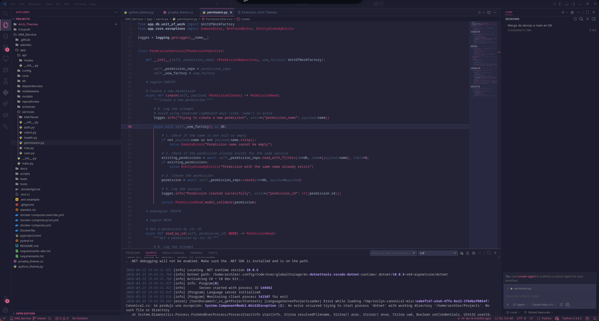
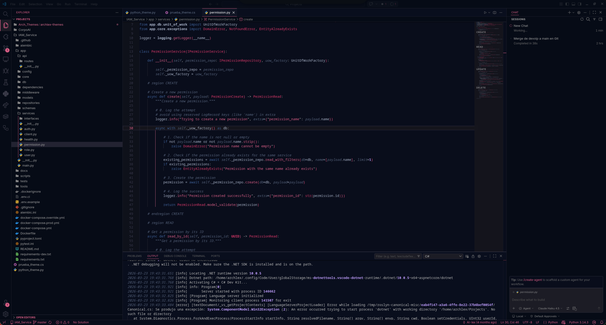
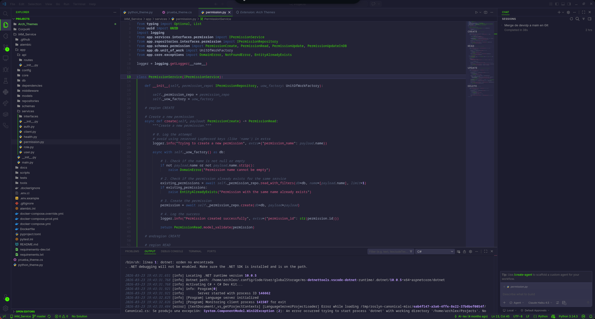
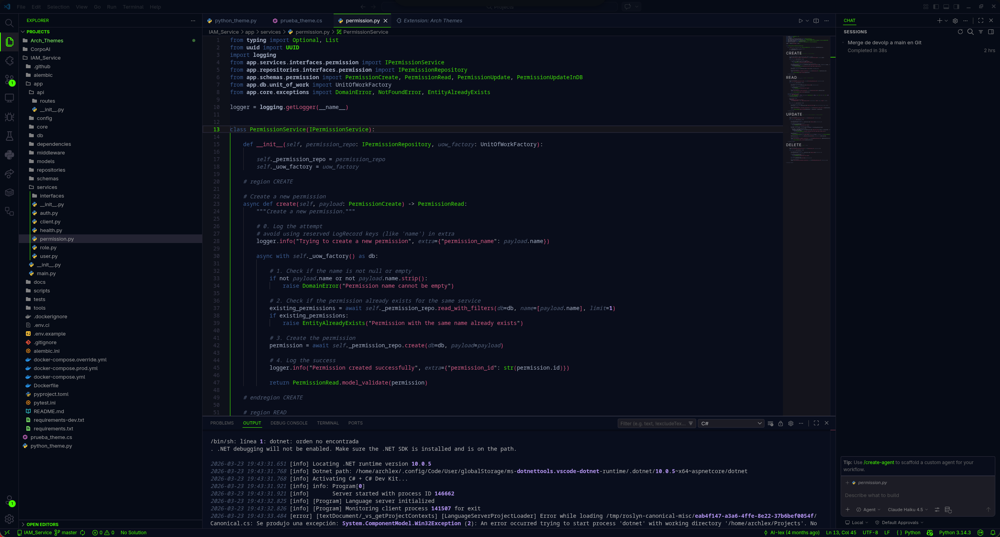
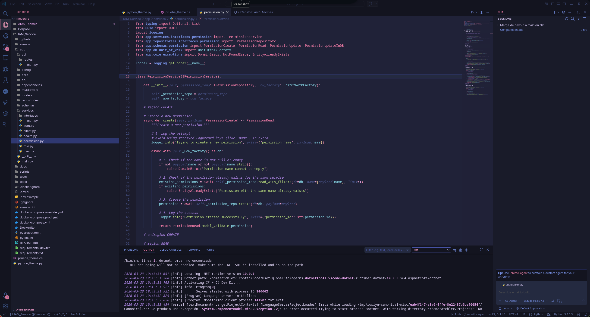
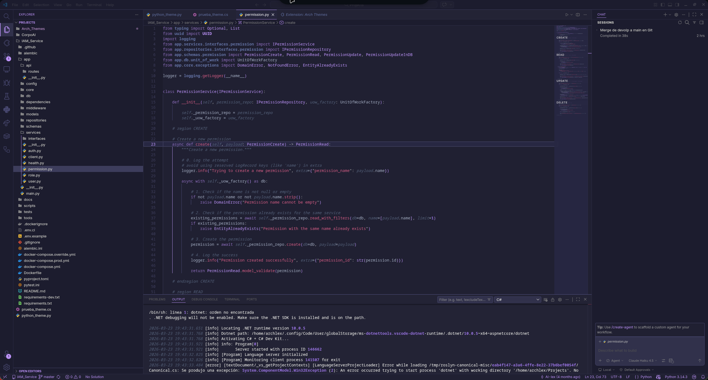

# Archlex Themes

A collection of modern, clean, and carefully crafted color themes for Visual Studio Code. Each theme offers a unique aesthetic while maintaining excellent readability and reducing eye strain during extended coding sessions.

## 🎨 Available Themes

| Theme | Description | Preview |
|-------|-------------|---------|
| **Arch Carmine** | Warm burgundy and red tones with excellent contrast |  |
| **Arch Carmine Dark** | Dark variant of Arch Carmine for low-light environments |  |
| **Arch Green** | Fresh, calming green palette perfect for long coding sessions |  |
| **Arch Green Dark** | Dark variant of Arch Green with reduced brightness |  |
| **Arch Pink** | Soft pink and coral colors with vibrant accents |  |
| **Arch Purple** | Elegant purple tones for a professional look |  |

## 📦 Installation

### From VS Code Marketplace
1. Open VS Code
2. Go to `Extensions` (Ctrl+Shift+X / Cmd+Shift+X)
3. Search for "Arch Themes"
4. Click Install

### Manual Installation
1. Clone or download this repository
2. Copy the theme files to your local extensions folder:
   - **Windows**: `%APPDATA%\Code\User\extensions\arch-themes`
   - **macOS**: `~/.vscode/extensions/arch-themes`
   - **Linux**: `~/.vscode/extensions/arch-themes`

## 🎯 How to Use

1. Open VS Code settings (File > Preferences > Settings / Ctrl+,)
2. Search for "Color Theme"
3. Select your preferred Arch theme from the dropdown

Or use the keyboard shortcut: **Ctrl+K Ctrl+T** (Cmd+K Cmd+T on macOS)

## 📝 Customization

Each theme is fully customizable. Edit the JSON theme files in the `archlex-themes/themes/` directory to adjust colors to your preference.

## 💡 Tips

- Try switching between light and dark variants throughout the day
- Each variant is optimized for different lighting conditions
- The theme works great with popular VS Code extensions and fonts

## 📄 License

MIT - Feel free to use and modify these themes for personal or commercial projects.

## 👤 Author

**Archlex** - Creating beautiful development environments

---

Enjoy coding with Archlex Themes! 🚀
